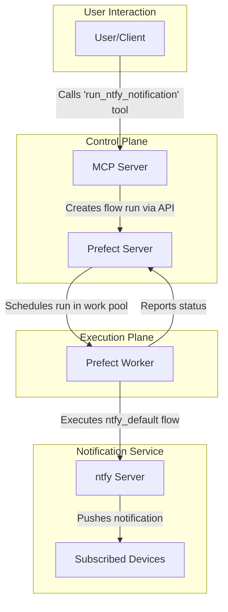
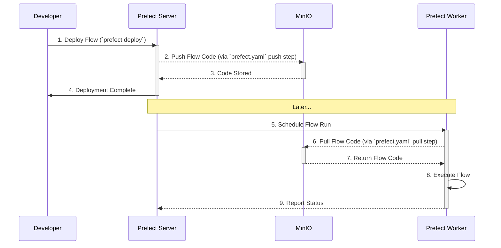

# Prefect Notifications

This project is an "out of the box" notification system orchestrated by [Prefect](https://prefect.io), with a custom MCP server providing an API to trigger notifications via [ntfy.sh](https://ntfy.sh/), using Docker Compose.

Leveraging a workflow system is useful when you want to have your agent or LLM take actions in response to events, or on a scheduled basis, and notify you proactively.  It is perfectly practical to set up cron jobs every day -- for example, [this AI assistant that does scheduled jobs every day](https://www.geoffreylitt.com/2025/04/12/how-i-made-a-useful-ai-assistant-with-one-sqlite-table-and-a-handful-of-cron-jobs) -- but what if you have a batch encoding job that needs monitoring, or a number of tasks that are only valid for a limited time?  Having the LLM be able to create its own workflows and set up its own cron jobs and reminders would be ideal, and that's exactly what a workflow system does.

Prefect is great as a workflow system, because flows are written and stored in Python code, and can be scheduled and run in various complex ways.  It is straightforward to store flows in source control, and flows and tasks are not limited to the directed acyclic graph (DAG) model.

## Running

```
docker compose up --build
```

You can inspect the running services on localhost:

* [Prefect Admin UI](http://localhost:4200)
* [MinIO UI](http://localhost:9000)
* [ntfy UI](http://localhost)
* The MCP server is available at http://localhost:8000/sse and you can access it with [MCP Inspector](https://modelcontextprotocol.io/docs/tools/inspector) or [Context](https://github.com/indragiek/Context).

## Configuration

There's several parts to the Docker Compose file:

* Postgres Database: this stores all the persistent state for Prefect.
* Prefect Server: this handles all the metadata and the engine, particularly blocks and configuration for flows.
* Prefect Worker: this handles the running of flow deployments.
* MinIO: this handles the storage of flow code (other options are git repos and docker images).
* MCP: this exposes a targeted subset of workflow functionality to an LLM.
* ntfy: this is a notification service that goes ping, and can send messages to iPhone or Android.



## Flow Deployment

Flows are a bit confusing, because although they exist as python code, they are designed to run as jobs.  From a very high level view, it works as follows:

* A flow is a template.  You write a flow as a python method, and it can have tasks and even have transaction semantics and rollback on failure.
* A deployment is when a flow is pushed out to flow storage (MinIO in this case), and is runnable by a worker. A deployment may run in response to events, or may run on a scheduled basis.
* A run of a deployment is a job that goes into the "run queue" and is picked up by a prefect worker.  In this case, a prefect worker is a docker container that pulls the flow from MinIO and executes it, posting the result and recording the exit status.

