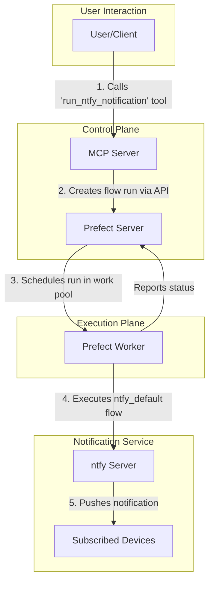
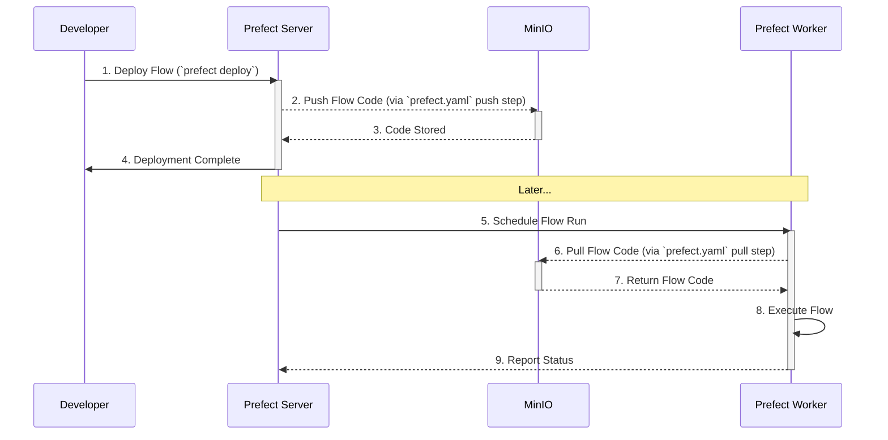

### Prefect Notifications

This project is a notification system orchestrated by Prefect, with a custom MCP server providing an API to trigger notifications and manage Prefect deployments. It uses `ntfy` for push notifications.

---

#### **Prefect Server and Worker**

*   **Role and Functionality:**
    *   The **Prefect Server** is the central component for orchestrating and managing workflows (flows). As defined in `docker-compose.yml`, it runs the `prefecthq/prefect:3-latest` image, provides a web UI and an API on port `4200`, and uses a PostgreSQL database for state management. The server is responsible for scheduling flow runs, storing flow and deployment metadata, and tracking the state of all runs. Upon startup, it initializes custom Prefect blocks and deploys the notification flow from the `prefect/` directory.
    *   The **Prefect Worker** (`prefect-worker` service) is responsible for executing the flow runs scheduled by the server. It also uses the `prefecthq/prefect:3-latest` image and is configured to connect to the Prefect server's API. It listens for work from a specific work pool (`default-docker-pool`) and executes the assigned tasks within a Docker environment, as indicated by its command and volume mounts in `docker-compose.yml`.

*   **Interaction:**
    *   The Prefect Server and Worker operate in a classic agent-based architecture. The server schedules a flow run, and the worker picks it up from the work pool and executes the code. The worker communicates its status and results back to the server, which are then visible in the UI.

---

#### **ntfy**

*   **Role and Functionality:**
    *   **`ntfy`** is a simple, open-source pub-sub notification service. In this project, it is defined as the `ntfy` service in `docker-compose.yml`. Its purpose is to receive notification requests and push them to subscribed clients (e.g., mobile phones or web browsers). It exposes an HTTP endpoint for this purpose.

*   **Integration with Prefect Flow:**
    *   The integration is achieved through a custom Prefect block, `NtfyWebHook`, which is registered and configured as described in `prefect/README.md`. The `prefect/ntfy_flow.py` file defines the `ntfy_default` flow, which loads this pre-configured `NtfyWebHook` block and calls its `notify` method. This sends the `body` and `subject` of the notification to the `ntfy` server's topic, which then broadcasts it to subscribers.

---

#### **MCP Server**

*   **Role and Functionality:**
    *   The **MCP (Model Context Protocol) Server**, defined as the `prefect-mcp` service in `docker-compose.yml`, is a custom FastAPI application built from the `mcp/` directory. Its primary purpose is to provide a simplified, high-level API for interacting with the Prefect system.
    *   Based on `mcp/main.py`, the MCP server exposes several tools:
        *   `run_prefect_flow`: A generic tool to trigger any Prefect deployment by name with specified parameters.
        *   `run_ntfy_notification`: A convenience tool that specifically triggers the `ntfy` notification flow.
        *   `list_prefect_deployments`: A tool to list all available deployments in the Prefect server.
        *   `get_deployment_parameters`: A tool to retrieve the parameters for a specific deployment.

*   **Interaction with Other Components:**
    *   The MCP server acts as a bridge or an abstraction layer. It communicates directly with the **Prefect Server's API** to trigger flow runs and query deployment information. By calling the `run_ntfy_notification` tool on the MCP server, a user can initiate the entire notification workflow:
        1.  The MCP server receives the request.
        2.  It calls the Prefect Server's API to create a new flow run for the `ntfy_default` deployment.
        3.  The Prefect Server schedules the run.
        4.  The Prefect Worker picks up and executes the flow.
        5.  The flow sends a notification to the `ntfy` server.

### **Overall System Interaction**

The components form a cohesive, event-driven system:

In summary, a user interacts with the high-level MCP Server, which translates the request into a Prefect flow run. The Prefect Server and Worker handle the orchestration and execution, and the `ntfy` service delivers the final notification. This architecture separates concerns, making the system modular and extensible.

---

### **MinIO Storage for Flow Code**

This project uses **MinIO** as a remote, S3-compatible object store for flow source code. This decouples the flow code from the execution environment, allowing workers to dynamically fetch and execute the correct version of a flow without needing the code to be pre-baked into their images.

*   **Storage Configuration:**
    *   The [`prefect/init_minio_blocks.py`](prefect/init_minio_blocks.py) script creates a Prefect `S3Bucket` block named `minio-prefect-flows`. This block is configured to connect to the `minio` service and use the `prefect-flows` bucket, which is automatically created by the `minio-init` service in [`docker-compose.yml`](docker-compose.yml).

*   **Code Push on Deployment:**
    *   When a flow is deployed (e.g., by running `prefect deploy --all`), the `push` step defined in [`prefect/prefect.yaml`](prefect/prefect.yaml) is executed.
    *   This step uses the `prefect_aws.deployments.steps.push_to_s3` function, which references the `minio-prefect-flows` block. It packages the flow's source code (e.g., [`prefect/ntfy_flow.py`](prefect/ntfy_flow.py)) and uploads it to the `prefect-flows` bucket in MinIO.

*   **Code Pull on Execution:**
    *   When the Prefect Server schedules a flow run, it instructs a worker to execute it.
    *   Before running the flow, the worker executes the `pull` steps defined in [`prefect/prefect.yaml`](prefect/prefect.yaml).
    *   The `prefect_aws.deployments.steps.pull_from_s3` function is called, which again uses the `minio-prefect-flows` block to download the correct flow code from the MinIO bucket into the worker's local filesystem.
    *   Once the code is downloaded, the worker executes it.

This entire process is illustrated below:

