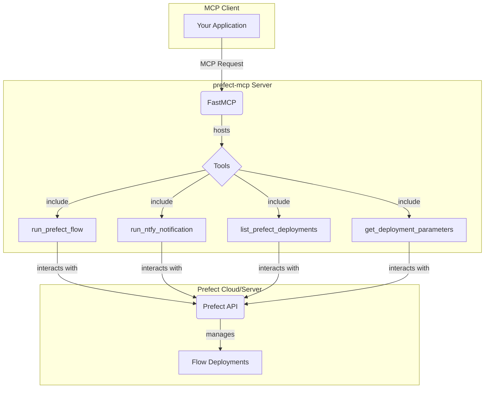

# Prefect MCP Server

The `prefect-mcp` server is a `FastMCP` application that provides a set of tools for interacting with a Prefect server. It allows you to run Prefect flow deployments, list available deployments, and get detailed information about their parameters. This enables remote execution and monitoring of Prefect workflows from any MCP-compatible client.

The server will start on `http://0.0.0.0:8000`.

## Architecture

The following diagram illustrates the architecture of the `prefect-mcp` system:

## Features

- **Run Prefect Flows:** Execute any Prefect flow deployment with custom parameters.
- **Simplified Notifications:** A dedicated tool to run notification flows with a simple interface.
- **List Deployments:** Get a comprehensive list of all available deployments in your Prefect server.
- **Inspect Parameters:** Retrieve detailed information about the parameters required for a specific deployment.

## Available Tools

The following tools are available through the `prefect-mcp` server:

### `run_prefect_flow`

Runs a Prefect flow deployment using the Prefect Python client.

- **`deployment_name`**: The name of the deployment to run.
- **`parameters`**: A JSON string of parameters to pass to the flow.

### `run_ntfy_notification`

A convenience function to run the `ntfy` notification flow with simple parameters.

- **`body`**: The notification message body.
- **`subject`**: The notification subject or title.
- **`deployment_name`**: The name of the deployment to run.

### `list_prefect_deployments`

Lists all available Prefect deployments.

### `get_deployment_parameters`

Get detailed parameter information for a specific Prefect deployment.

- **`deployment_name`**: The name of the deployment to get parameters for.
